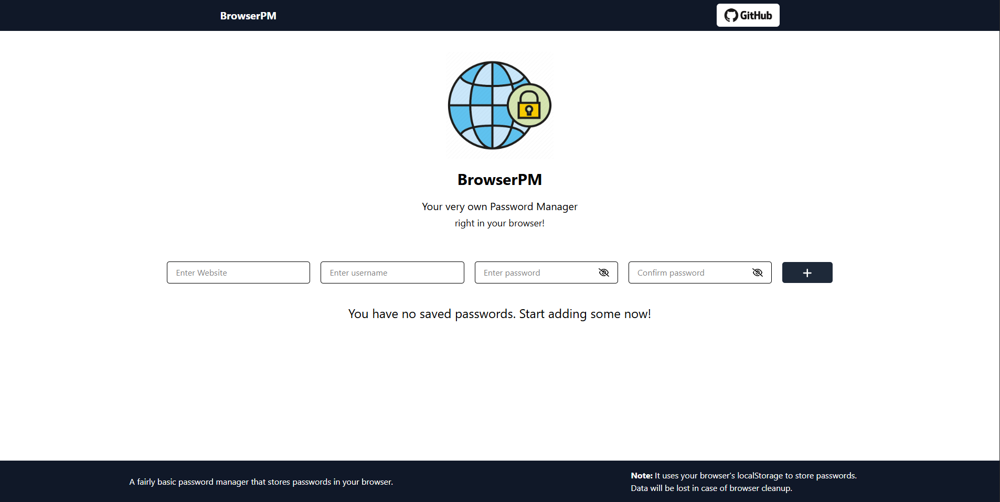

# BrowserPM 🔐

**BrowserPM** is a simple password manager built with **React** and **Redux**, designed to run entirely in your browser. It allows you to securely store and manage your passwords using the browser's `localStorage`.

## Features

- Add and manage website login credentials.
- Edit existing password records.
- Delete saved records with confirmation.
- Copy usernames and passwords to clipboard.
- Data is stored locally in `localStorage` (no server needed).
- Redux is used for state management.

## Technologies Used

- React
- Redux Toolkit
- Font Awesome Icons
- React Toastify
- Tailwind CSS

## Folder Structure

- `/components/AddPassword.js` – Add new records with form validation.
- `/components/AllPasswords.js` – Display, edit, delete, and copy records.
- `/store/slice.js` – Redux slice handling all CRUD operations.

---

Made with ❤️ using React.